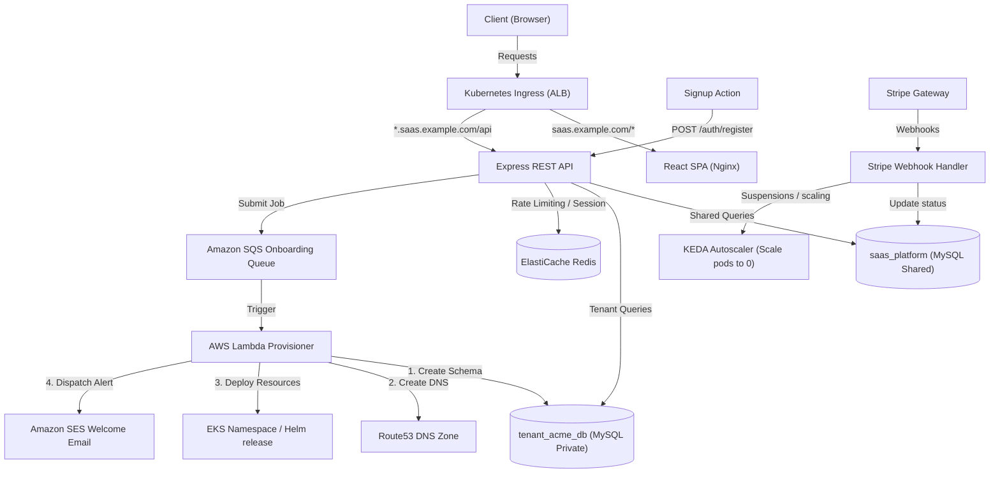

# Multi-Tenant SaaS Subscription Billing Platform

This project implements a B2B SaaS infrastructure offering subdomain-based routing, database-per-tenant isolation, automated onboarding pipelines, and billing integration using Stripe.

---

## 🏗️ Architecture Design Overview



---

## 🛠️ Technology Stack

- **Frontend**: React 18 + TypeScript + Tailwind CSS + Recharts + Stripe.js Elements.
- **Backend**: Node.js + Express.js + Sequelize ORM + Socket.io + Redis + node-cron.
- **AWS Infrastructure**: EKS (Kubernetes 1.29), RDS MySQL 8, ElastiCache Redis 7, SQS, SES, Route53, Secrets Manager.
- **Deployment & Scaling**: Docker Compose, Helm Charts, ArgoCD GitOps pipelines, KEDA (Event-driven scaling).

---

## 📂 Repository Directory Layout

```text
saas-billing/
├── frontend/src/
│   ├── components/       # Layout frames, stepper components
│   ├── context/          # AuthContext, TenantContext
│   ├── pages/            # Landing, Login, Signup, Billing, APIKeys, AdminPanel...
│   ├── services/         # Axios API Client configuration
│   └── utils/            # Subdomain extraction helper
├── backend/src/
│   ├── controllers/      # Route logic handlers (auth, billing, tenant-api)
│   ├── database/         # MySQL connection configurations, seeders
│   ├── middleware/       # JWT auth, dynamic tenant resolver
│   ├── models/           # Shared Sequelize tables
│   ├── services/         # Stripe, SES, Socket, and Provisioning integrations
│   ├── tenant/           # Dynamic connection pools and isolated tenant models
│   └── webhooks/         # Stripe signature hook verification
├── lambda/               # Onboarding coordinator function code
├── k8s/                  # Kubernetes manifest templates (ALB Ingress, HPA, KEDA)
├── helm/saas-billing/    # Chart structures and per-tenant override values
├── argocd/               # ArgoCD App-of-apps registry
└── terraform/            # Infrastructure declarations
```

---

## 🚀 Local Development Setup

To run the local ecosystem containing MySQL, Redis, Adminer, Stripe-CLI, Frontend, and Backend:

### 1. Copy Environment Parameters
Configure environment keys in `backend/` and `frontend/`:
```bash
cp .env.example .env
```

### 2. Launch Orchestrated Environment
Run Docker Compose:
```bash
docker-compose up --build -d
```
The services will register at:
- **Frontend App**: `http://localhost`
- **Backend Port**: `http://localhost:5000`
- **Adminer DB Editor**: `http://localhost:8080` (Username `root`, Password `rootpassword`)

### 3. Initialize Demo Databases & Seeders
Populate plans, tenants (acme, globex, initech), team members, and telemetry logs:
```bash
docker-compose exec backend npm run seed
```

---

## ⚡ Automated Onboarding Pipeline (10 Steps)

On member signup, the backend triggers an SQS event executing our Lambda provisioning sequence:
1. **Job Start**: Updates `provisioning_jobs` status to `in_progress`.
2. **Database Provisioning**: Spins up an isolated database schema: `tenant_{slug}_db` on RDS.
3. **Table Sync**: Executes SQL tables mappings (users, keys, usage logs).
4. **Owner Seeding**: Creates the administrator profile with credentials.
5. **EKS Namespace Isolation**: Deploys a dedicated Kubernetes namespace `tenant-{slug}`.
6. **Helm Values Overlay**: Implements resource configuration rules and backend overrides.
7. **DNS Configuration**: Creates CNAME record mapping `{slug}.saas.example.com` to the Application Load Balancer.
8. **Shared Registry Sync**: Marks tenant database and subdomain status `active` in `saas_platform`.
9. **Welcome Email**: Transmits portal log in parameters via SES.
10. **Finalization**: Sets job status to `completed` enabling client redirects.

---

## 📈 Auto-scaling with KEDA

We deploy KEDA operators to scale resource allocations based on usage event queues:
- **Idle workspaces**: Scaled down to `0` replicas if Stripe subscription status becomes `suspended` or `cancelled`.
- **Telemetry ingestion**: Scales pods between `1` and `3` depending on SQS queue backlog depths.
- **Billing aggregates**: Automatically scales to `5` replicas during cron processing intervals to handle invoice calculations.
